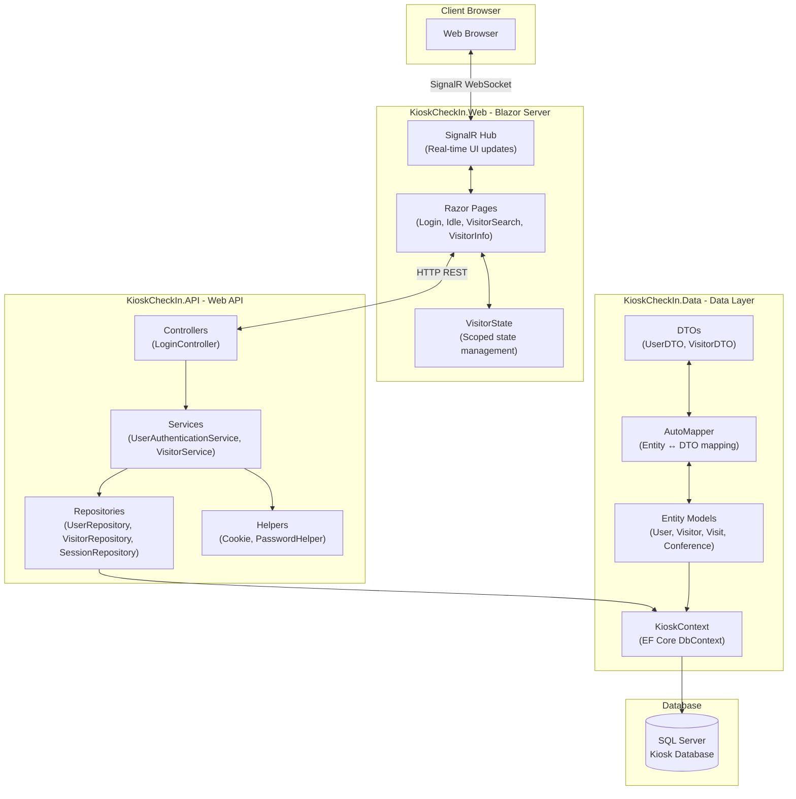
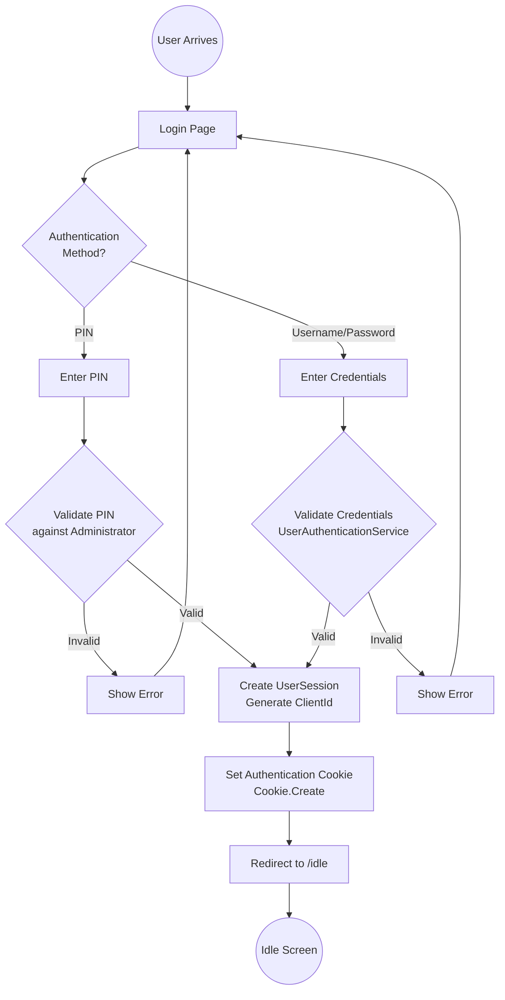
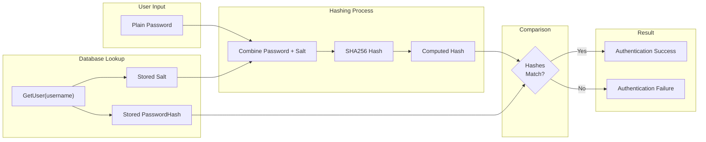
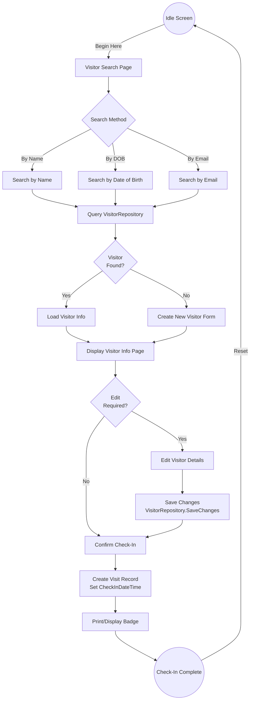
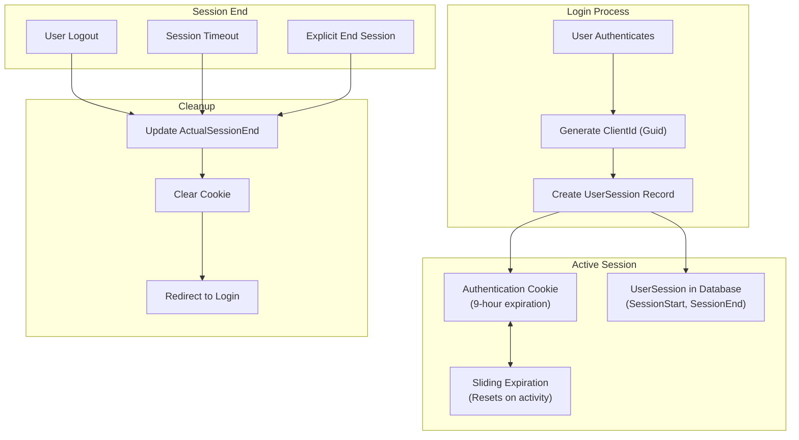
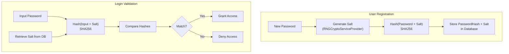

# Visitor Kiosk - Blazor Server

<div align="center">

**Secure Facility Visitor Check-In System**

[](https://dotnet.microsoft.com/)
[](https://blazor.net/)
[](https://docs.microsoft.com/en-us/ef/core/)

*A demonstration application for secure visitor management at controlled-access facilities*

</div>

---

## Table of Contents

- [Overview](#overview)
- [Key Features](#key-features)
- [System Architecture](#system-architecture)
- [Authentication Flow](#authentication-flow)
- [Visitor Check-In Flow](#visitor-check-in-flow)
- [Session Management](#session-management)
- [Project Structure](#project-structure)
- [Data Models](#data-models)
- [API Endpoints](#api-endpoints)
- [Security Implementation](#security-implementation)
- [Installation](#installation)
- [Configuration](#configuration)
- [Tech Stack](#tech-stack)

---

## Overview

The **Visitor Kiosk** application is a Blazor Server-based system designed to simulate visitor check-in processes for secure facilities such as defense contractors, government buildings, or corporate campuses. It demonstrates modern .NET patterns including:

- Cookie-based authentication suitable for Blazor Server's SignalR architecture
- Repository pattern for clean data access
- Dependency injection throughout
- Secure password hashing with salted SHA256

### Purpose

This application serves as both a functional prototype and an educational reference implementation, showcasing best practices for:
- User authentication and session management
- Secure password storage
- Clean architecture with separation of concerns
- Blazor Server component design

---

## Key Features

| Feature | Description |
|---------|-------------|
| **Dual Authentication** | Supports both PIN and username/password login |
| **Visitor Management** | Search, view, and edit visitor information |
| **Session Tracking** | Tracks user sessions with configurable expiration |
| **Clearance Handling** | Manages visitor security clearances and special accesses |
| **Educational Mode** | Includes code snippet pages explaining authentication flow |
| **Check-In/Check-Out** | Records visitor arrival and departure times |

---

## System Architecture

The solution follows a clean multi-project architecture separating concerns across layers:



### Layer Responsibilities

| Layer | Project | Purpose |
|-------|---------|---------|
| **Presentation** | KioskCheckIn.Web | Blazor Server UI, Razor pages, state management |
| **API** | KioskCheckIn.API | REST endpoints, business logic, authentication services |
| **Data Access** | KioskCheckIn.Data | Entity models, DTOs, AutoMapper profiles, EF Core context |
| **Shared** | KioskCheckIn.Shared | Cross-cutting dependencies |

---

## Authentication Flow

The authentication process supports both PIN-based quick access and traditional username/password login:



### Password Validation Process



---

## Visitor Check-In Flow

The visitor check-in process from kiosk interaction to database record:



### Visitor Data Structure

```mermaid
flowchart LR
    subgraph VISITOR["Visitor Entity"]
        V_ID["Id (int)"]
        V_NAME["FirstName, MiddleName, LastName"]
        V_DOB["DateOfBirth"]
        V_CONTACT["Email, Employer"]
        V_ADDRESS["StreetAddress, City, State, ZipCode"]
        V_SECURITY["Clearances, SAs (Special Accesses)"]
        V_VISIT["ConferenceId, VisitTypeId, CheckInTime"]
    end

    subgraph VISIT["Visit Entity"]
        VIS_ID["Id (int)"]
        VIS_VISITOR["VisitorId (FK)"]
        VIS_IN["CheckInDateTime"]
        VIS_OUT["CheckOutDateTime"]
    end

    VISITOR -->|"1:Many"| VISIT
```



---

## Session Management

User sessions are tracked for security and auditing purposes:



### Session Entity

| Field | Type | Description |
|-------|------|-------------|
| Id | int | Primary key |
| UserId | int | Foreign key to User |
| Username | string | Username for quick lookup |
| SessionStart | DateTime | When session began |
| SessionEnd | DateTime | Planned expiration |
| ActualSessionEnd | DateTime | When session actually ended |
| ClientId | Guid | Unique session identifier |

---

## Project Structure

```
Blazor Kiosk/
├── KioskCheckIn.Web/                    # Blazor Server Frontend
│   ├── Pages/
│   │   ├── Login.razor                  # Authentication page (/)
│   │   ├── Index.razor                  # Home page (/home)
│   │   ├── Idle.razor                   # Waiting screen (/idle)
│   │   ├── VisitorSearch.razor          # Search visitors (/visitorsearch)
│   │   ├── VisitorInfo.razor            # Visitor details (/visitorinfo)
│   │   ├── KioskInformation.razor       # Info page (/kioskinformation)
│   │   ├── LoginEnpoint.razor           # Code demo (/loginendpointcodesnip)
│   │   └── AuthenticationCodeSnip.razor # Code demo (/authcodesnip)
│   ├── Shared/
│   │   ├── MainLayout.razor             # App layout
│   │   └── NavMenu.razor                # Navigation
│   ├── Data/
│   │   └── VisitorState.cs              # Scoped visitor state
│   ├── wwwroot/                         # Static assets
│   └── Program.cs                       # Blazor Server startup
│
├── KioskCheckIn.API/                    # Web API Backend
│   ├── Controllers/
│   │   └── LoginController.cs           # Authentication endpoint
│   ├── Services/
│   │   ├── UserAuthenticationService.cs # Auth logic
│   │   └── VisitorService.cs            # Visitor operations
│   ├── Repository/
│   │   ├── IUserRepository.cs           # User data interface
│   │   ├── UserRepository.cs            # User data implementation
│   │   ├── IVisitorRepository.cs        # Visitor data interface
│   │   ├── VisitorRepository.cs         # Visitor data implementation
│   │   ├── IUserSessionRepository.cs    # Session interface
│   │   └── UserSessionRepository.cs     # Session implementation
│   ├── Helpers/
│   │   ├── Cookie.cs                    # Cookie authentication helper
│   │   ├── PasswordHelper.cs            # Password hashing utilities
│   │   ├── VisitorState.cs              # State management
│   │   └── AuthResult.cs                # Authentication result model
│   └── Program.cs                       # API startup & DI config
│
├── KioskCheckIn.Data/                   # Data Access Layer
│   ├── Models/
│   │   ├── User.cs                      # User entity
│   │   ├── Visitor.cs                   # Visitor entity
│   │   ├── Visit.cs                     # Visit record entity
│   │   ├── UserSession.cs               # Session entity
│   │   ├── Administrator.cs             # Admin entity
│   │   ├── Conference.cs                # Conference entity
│   │   └── VisitType.cs                 # Visit type entity
│   ├── DTO/
│   │   ├── UserDTO.cs                   # User transfer object
│   │   └── VisitorDTO.cs                # Visitor transfer object
│   ├── MapperProfile.cs                 # AutoMapper configuration
│   └── KioskContext.cs                  # EF Core DbContext
│
├── KioskCheckIn.Shared/                 # Shared Dependencies
│
├── KioskCheckInSolution.sln             # Solution file
└── README.md                            # This file
```

---

## Data Models

### Entity Relationship Diagram

```mermaid
erDiagram
    USER ||--o{ USER_SESSION : "has"
    USER ||--o| ADMINISTRATOR : "may be"
    VISITOR ||--o{ VISIT : "makes"
    VISITOR }o--|| CONFERENCE : "attends"
    VISITOR }o--|| VISIT_TYPE : "has"

    USER {
        int UserId PK
        string Username
        string FirstName
        string LastName
        string PasswordHash
        string Salt
        string StreetAddress
        string City
        string State
        string ZipCode
        bool Administrator
    }

    ADMINISTRATOR {
        int UserId PK_FK
        string PIN
        string Username
    }

    USER_SESSION {
        int Id PK
        int UserId FK
        string Username
        datetime SessionStart
        datetime SessionEnd
        datetime ActualSessionEnd
        guid ClientId
    }

    VISITOR {
        int Id PK
        string FirstName
        string MiddleName
        string LastName
        date DateOfBirth
        string Email
        string Employer
        string Gender
        string StreetAddress
        string City
        string State
        string ZipCode
        string Clearances
        string SAs
        int ConferenceId FK
        int VisitTypeId FK
        datetime CheckInTime
    }

    VISIT {
        int Id PK
        int VisitorId FK
        datetime CheckInDateTime
        datetime CheckOutDateTime
    }

    CONFERENCE {
        int Id PK
        string Name
        date From
        date To
    }

    VISIT_TYPE {
        int Id PK
        string TypeOfVisit
    }
```

---

## API Endpoints

### Login Controller

| Endpoint | Method | Auth | Description |
|----------|--------|------|-------------|
| `/api/login` | POST | Anonymous | Authenticate user |

**Request Body (UserDTO):**
```json
{
  "username": "string",
  "password": "string",
  "pin": "string",
  "clientId": "guid"
}
```

**Response (AuthResult):**
```json
{
  "isAuthenticated": true
}
```

**Response Codes:**
| Code | Description |
|------|-------------|
| 200 | Authentication successful |
| 401 | Authentication failed |

---

## Security Implementation

### Password Security Flow



### Security Features

| Feature | Implementation |
|---------|----------------|
| Password Hashing | SHA256 with cryptographic salt |
| Salt Generation | RNGCryptoServiceProvider |
| Session Cookies | HttpOnly, Secure, SameSite |
| Session Expiration | 9-hour sliding window |
| Role-Based Access | Administrator flag on User |

---

## Installation

### Prerequisites

| Requirement | Version |
|-------------|---------|
| .NET SDK | 9.0+ |
| SQL Server | 2019+ |
| Visual Studio | 2022+ (recommended) |

### Setup Steps

```bash
# 1. Clone the repository
git clone <repository-url>
cd "Blazor Kiosk"

# 2. Restore dependencies
dotnet restore KioskCheckInSolution.sln

# 3. Update database connection string in:
#    - KioskCheckIn.API/appsettings.json
#    - KioskCheckIn.Web/appsettings.json

# 4. Run database migrations (if using EF migrations)
cd KioskCheckIn.API
dotnet ef database update

# 5. Run the API
cd KioskCheckIn.API
dotnet run

# 6. Run the Web UI (in separate terminal)
cd KioskCheckIn.Web
dotnet run
```

---

## Configuration

### Connection String

Located in `appsettings.json`:

```json
{
  "ConnectionStrings": {
    "DefaultConnection": "Server=YOUR_SERVER;Database=Kiosk;Trusted_Connection=True;TrustServerCertificate=True;"
  }
}
```

### Authentication Settings

```json
{
  "Authentication": {
    "CookieExpiration": "09:00:00",
    "SlidingExpiration": true,
    "LoginPath": "/",
    "AccessDeniedPath": "/denied"
  }
}
```

---

## Tech Stack

| Component | Technology | Version |
|-----------|------------|---------|
| **Framework** | .NET | 9.0 |
| **UI Framework** | Blazor Server | 9.0 |
| **Database** | SQL Server | 2019+ |
| **ORM** | Entity Framework Core | 8.0.11 |
| **Object Mapping** | AutoMapper | 15.0.1 |
| **Logging** | NLog | 6.0.1 |
| **Authentication** | ASP.NET Core Identity (Cookies) | 9.0 |

---

## Page Routes

| Route | Page | Description |
|-------|------|-------------|
| `/` | Login.razor | Authentication entry point |
| `/home` | Index.razor | Welcome page |
| `/idle` | Idle.razor | Waiting screen with "Begin Here" |
| `/visitorsearch` | VisitorSearch.razor | Search for visitors |
| `/visitorinfo` | VisitorInfo.razor | View/edit visitor details |
| `/kioskinformation` | KioskInformation.razor | System information |
| `/loginendpointcodesnip` | LoginEnpoint.razor | Code demonstration |
| `/authcodesnip` | AuthenticationCodeSnip.razor | Code demonstration |

---

<div align="center">

**Secure. Efficient. Educational.**

*A demonstration of modern .NET development practices*

</div>
